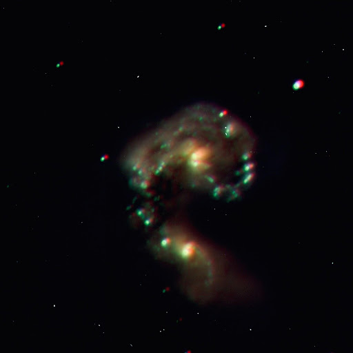
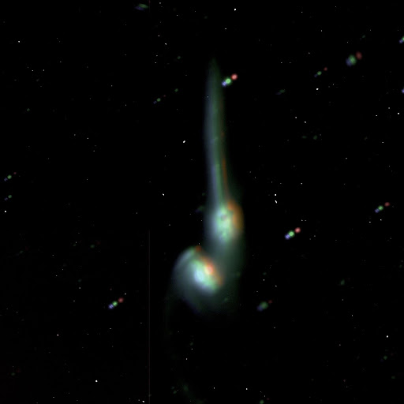

# astro-data-processing
Data processing code for Caltech's Ay/Ge107 (Astronomical Observation) course. 

See our final report about imaging interacting galaxies [here](./palomar_final_project_report.pdf).

